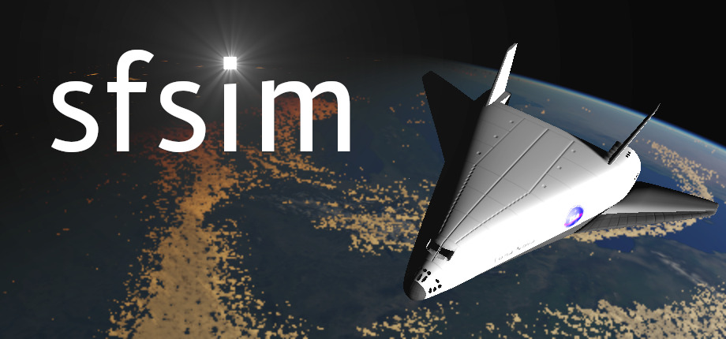

[][1]

[sfsim][1] is a realistic 3D space flight simulator with true celestial positions of Earth and Sun from NASA.
Use an advanced single-stage-to-orbit space craft to take off, orbit the planet, perform reentry, and land back on Earth.
sfsim features a true to scale Earth planet using NOAA elevation data and procedurally generated volumetric clouds.

### Take off
Blast off from the launch pad and slowly tilt your spacecraft to start building up horizontal speed and climb to orbital height.
Make sure you don't loose to much energy to air friction but also gather enough horizontal speed not to plunge back into the atmosphere.
<!-- insert take off animation -->

### Orbit the planet
Perform a controlled burn for orbital insertion.
Your orbit should be nearly circular and above the atmosphere.
If you get it wrong, you might enter the atmosphere unprepared and might even burn up!
<!-- insert animation of orbital insertion burn -->

### Perform reentry
Perform a deorbit burn and reentry to come out at the desired location.
Make sure you plan it right, otherwise you might end up over the ocean, or even burn up on reentry.
<!-- insert animation of reentry -->

### Land back on Earth
Approach the runway, deploy your landing gear, and touch down on the runway.
Apply the brakes, come to a standstill, and celebrate mission success.
Don't touch down to fast, or you might break the landing gear or even destroy the spacecraft. Don't touch down too late, or you will run out of runway.
<!-- insert animation of successful landing -->



## The project
Since a long time I wanted to develop a 3D space flight simulator.
As a kid I implemented several 2D space flight simulators on an Atari ST.
Many years later I saw Orbiter 2016 and I was inspired to create a free and open source space flight simulator.
After some half-hearted attempts, I decided to start the project for real in 2020.
I worked on the tough issues first and I finally managed to get to a point where I felt confident to create a Steam page showcasing early results.
Progress is slow as this is only a hobby project, but I hope to release a demo soon!

The beautiful ambient music used in the trailer was made by [Andrewkn][2]!

Wishlist it on Steam to get notified when it gets released:

  <iframe src="https://store.steampowered.com/widget/3687560/" frameborder="0" width="646" height="190"></iframe>

# News

[1]: https://wedesoft.github.io/sfsim/
[2]: https://freesound.org/people/Andrewkn/
